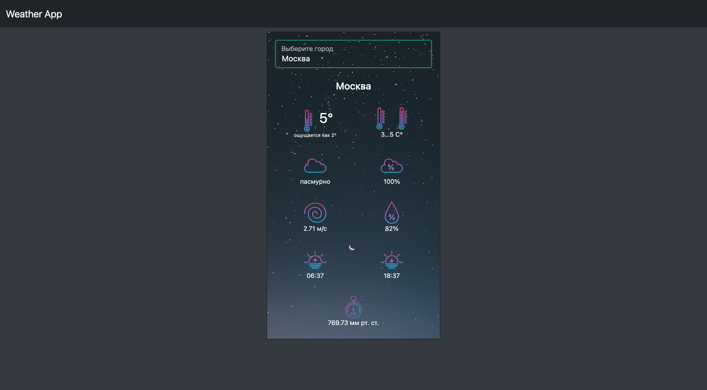

# Vue-weather-app

## Описание

Простое погодное приложение, созданное с использованием:
- Vue.js
- Bootstrap 5
- OpenWeatherMap API
- Автоматизация развертывания -> [deploy.sh](./deploy.sh)
## Демо версия

Приложение доступно на Github-pages.
- [Vue-weather-app](https://sou1jkeee.github.io/vue-weather-app/)
## Скриншоты приложения

<ul>
    <li>
      

        
PC-версия

          
      

    </li>
    <li>
      

        
Mobile-версия

        
      

    </li>
  </ul>
